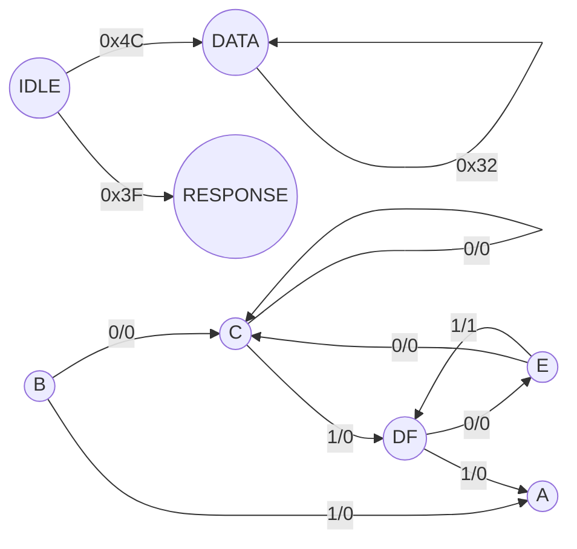
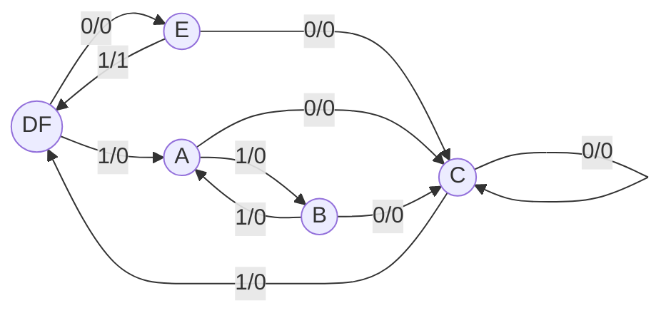

# LEMI-025

```mermaid
graph LR
   IDLE((IDLE))--0x4C-->DATA((DATA))
   IDLE((IDLE))--0x3F-->RESPONSE((RESPONSE))

   DATA((DATA))--0x30-->DATA((DATA))
   DATA((DATA))--0x32-->DATA((DATA))

   B((B))--0/0-->C((C))
   B((B))--1/0-->A((A))

   C((C))--0/0-->C((C))
   C((C))--1/0-->DF((DF))

   DF((DF))--0/0-->E((E))
   DF((DF))--1/0-->A((A))

   E((E))--0/0-->C((C))
   E((E))--1/1-->DF((DF))
```

```mermaid
graph LR
   DF((DF))--0/0-->E((E))
   E((E))--0/0-->C((C))
   A((A))--1/0-->B((B))
   E((E))--1/1-->DF((DF))
   A((A))--0/0-->C((C))
   C((C))--0/0-->C((C))
   DF((DF))--1/0-->A((A))
   B((B))--0/0-->C((C))
   B((B))--1/0-->A((A))
   C((C))--1/0-->DF((DF))
```