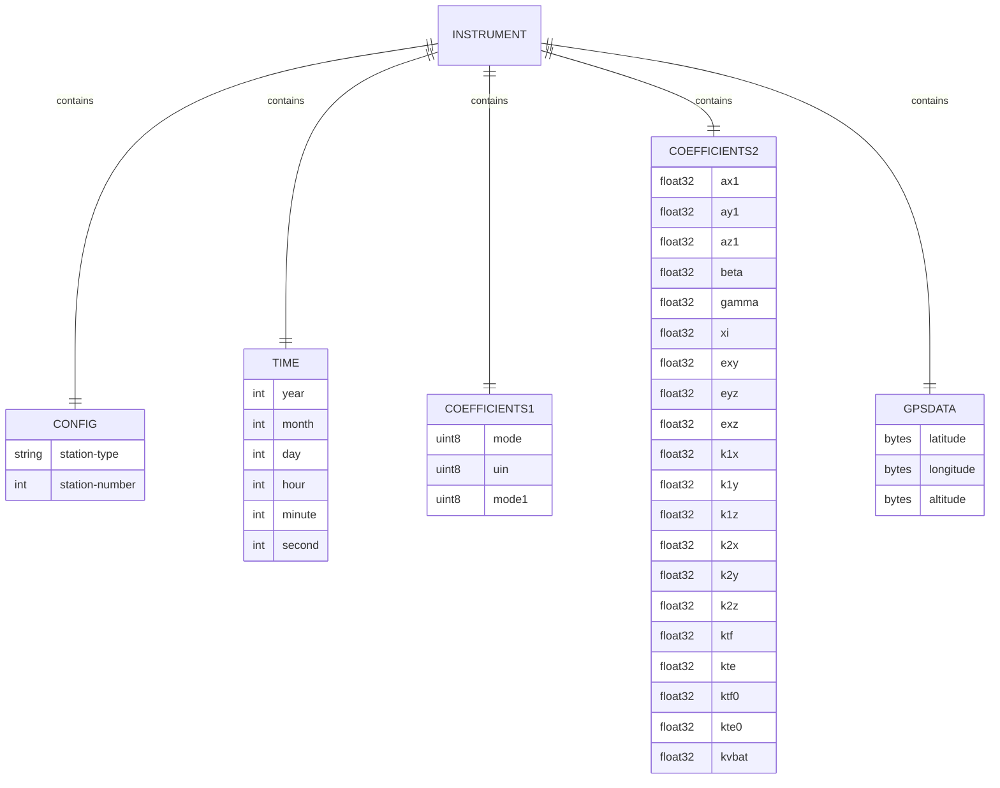

# Listing Context

This isn't just a "more or less one thing" package. This package contains a single Read Model along with all of the accompanying usecases. This context is specifically aimed at usecases involving "getting" and "listing" usecases, since these will require the same model and database type. (This is opposed to a "searching" usecase, which would most likely require a different kind of database).

There won't be any mutation of state happening in this context. This means that the model won't require an anti-corruption layer.

## Read Model
Below is the design of the read model:

## Use Cases
* GetInstrumentByID
* ListInstruments (GetAllInstruments?)